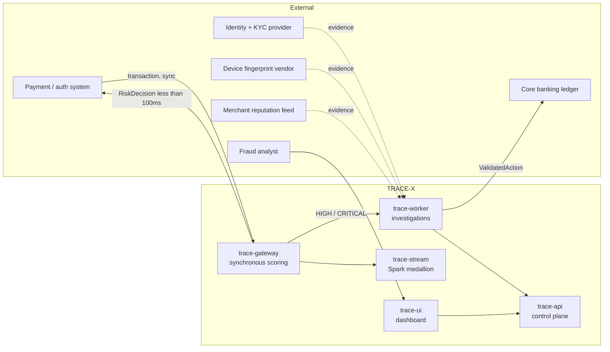
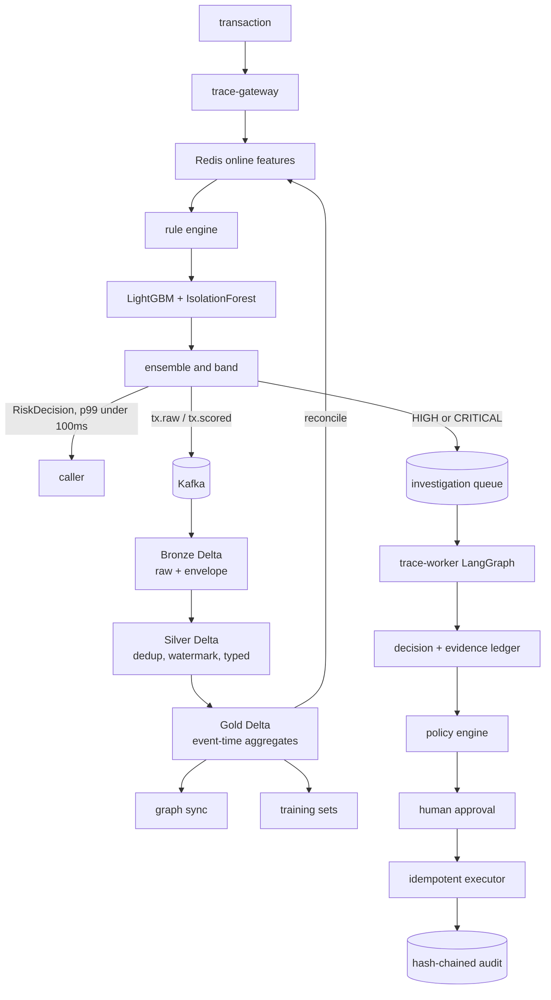
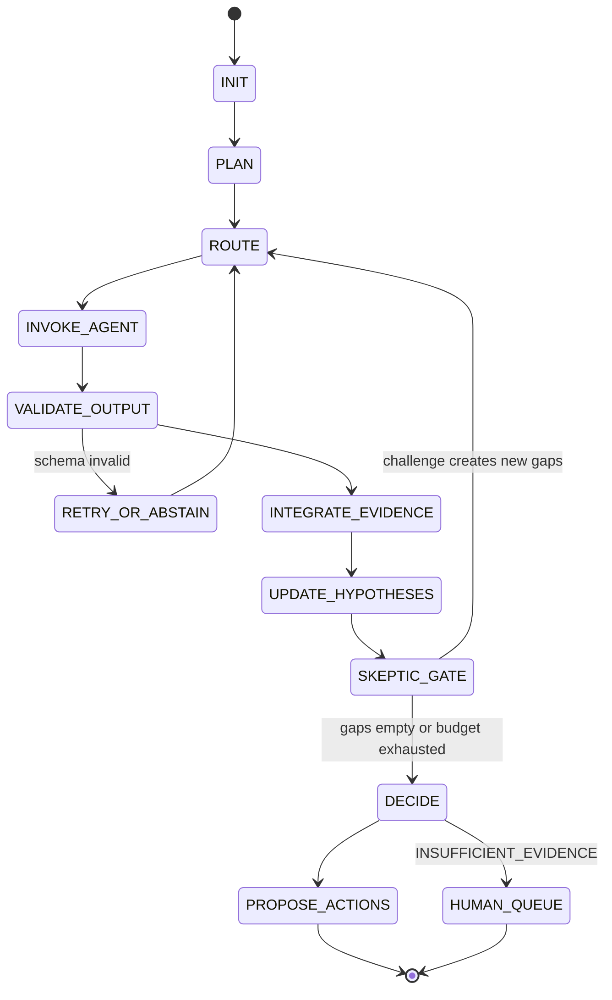
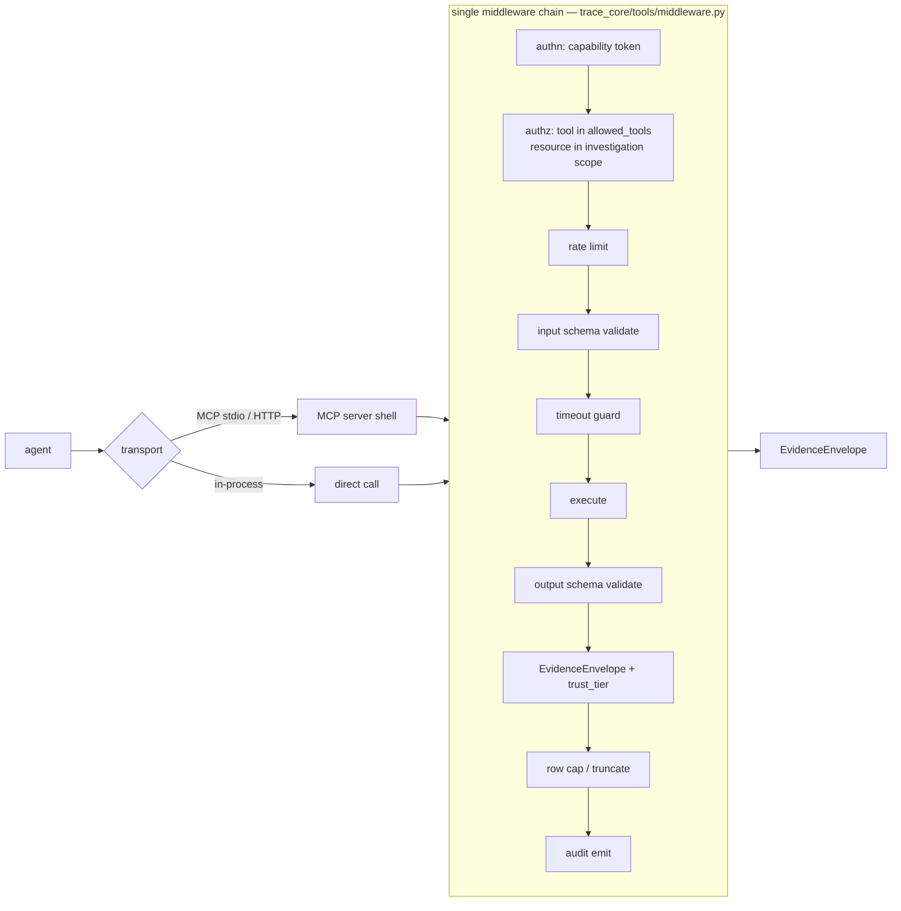
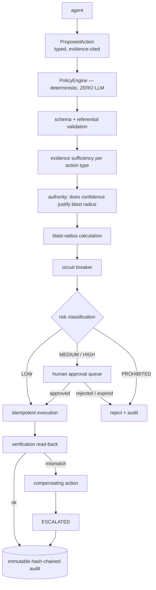
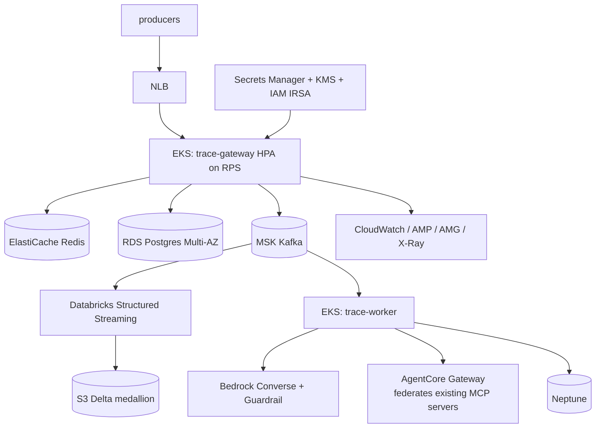
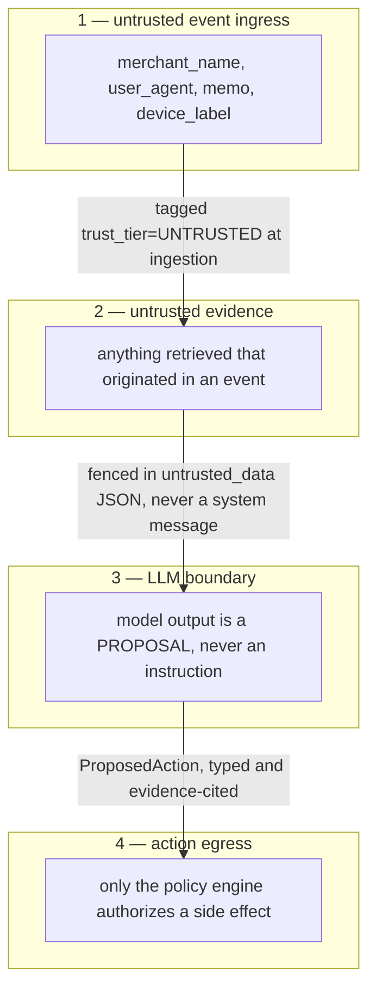
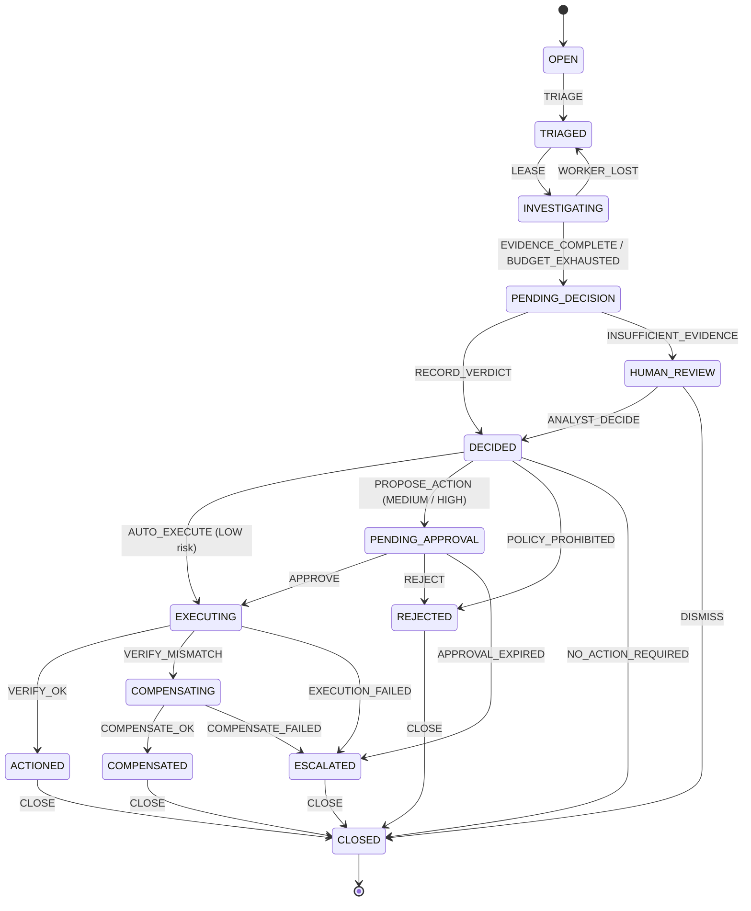

# TRACE-X — Architecture Specification

> Durable architecture specification. Authoritative for **design**; `docs/PROGRESS.md` is
> authoritative for **what exists**. If code and this document disagree, one of them is a bug —
> resolve it, do not let the drift stand.
>
> Decisions are recorded in `docs/adr/`. This document explains the system; ADRs explain *why* each
> choice was made and what was rejected.

---

## 1. System context

TRACE-X sits between a transaction authorization flow and a fraud operations team.



**Inside the boundary:** ingestion, feature computation, risk scoring, investigation orchestration,
evidence retrieval, decisioning, action proposal and policy gating, human approval, audit, evaluation.

**Outside, behind ports (never mocked in E2E):** the authorization system, the core banking ledger
(`ActionExecutor` port with a real `LocalLedgerAdapter` — a genuine Postgres-backed ledger service, so
the E2E path truly executes, verifies, and can fail), identity/device/merchant intelligence
(`EvidenceSource` ports with deterministic local implementations), and case-management/SIEM export.

**Non-goals:** settlement, chargeback lifecycle, multi-tenancy, real PII.

### Inbound data surfaces

Two, and both must work:

1. **Live event ingress** — the generator or any producer speaking `tx.raw.v1`.
2. **External dataset ingress** — a `SourceAdapter` port mapping a foreign schema onto
   `CanonicalTransaction`. Implementations: `GeneratorAdapter` (Track A) and `IeeeCisAdapter`
   (Track B). This is what makes "ingestion adaptability" a tested property rather than a claim.

---

## 2. Component boundaries

The core is **one Python package, `trace_core`**, deployed under four entrypoints plus three MCP
servers. Every process boundary has a stated technical reason; there are no others.

| Process | Reason it is separate | Why it is not merged |
|---|---|---|
| `trace-gateway` | Hot path, ~100 ms p99 budget, stateless, scales on TPS | Must never share a thread pool, connection pool or GC pause with 60-second LLM investigations |
| `trace-api` | Control plane; scales on analyst concurrency | Different SLO (seconds), different authz surface (human RBAC vs service tokens), different availability class |
| `trace-worker` | Investigations: 30–120 s, LLM-bound, checkpointed, retried; scales on queue depth. Since Phase 3 it also runs the outbox relay (ADR-0051 §7) | A long-running non-idempotent workload inside an HTTP server loses work on restart and truncates on request timeout. The pre-registered hot-path A/B ruled out the relay sharing the scoring process |
| `trace-stream` | JVM runtime, checkpointed, event-time stateful | Cannot run inside a Python web process |
| `trace-ui` | Different runtime | — |
| 3 MCP servers | A genuine protocol + serialization boundary for tool domains that must be independently addressable, independently authorized, and federatable by AgentCore later | Merging collapses the boundary the design asserts, and turns the Phase 12 Gateway step into a rewrite |

`trace-gateway` and `trace-api` are **the same codebase, two ASGI apps**, collapsible into one process
by `TRACE_SINGLE_PROCESS=1` for laptop development and split in `compose.full` / Kubernetes. The split
is a deployment choice, not a rewrite — that is the modular monolith paying off.

**Worker communication** is a Postgres-backed durable queue (`SELECT … FOR UPDATE SKIP LOCKED`), not
HTTP: investigations must survive worker crashes, and the queue row and the case row must move in one
transaction (ADR-0007).

```
packages/trace_core/
  domain/        entities, value objects, state machines, enums, errors
  contracts/     pydantic v2 models = the versioned wire contracts
  features/      online + offline feature definitions (single source of truth)
  rules/         deterministic rule engine
  scoring/       model loading, calibration, ensemble
  evidence/      evidence ledger, provenance, trust tiers
  tools/         registry, middleware chain, in-process + MCP client adapters
  agents/        agent specs, prompts, runtime adapters
  orchestration/ LangGraph graphs, evidence-gap router, budget manager
  policy/        deterministic policy engine (non-LLM)
  actions/       proposal to validation to execution to verification
  audit/         hash-chained audit log
  repositories/  Postgres / Redis / Neo4j / Delta adapters (ports + impls)
  observability/ OTel setup, metrics, PII-safe logging
  llm/           LLMProvider port + tier-tagged adapters
```

---

## 3. Data flow — the dual-path decision

The single most important architectural call: **Spark is not on the hot path.** Micro-batch latency
cannot serve a 100 ms authorization decision. Conflating the two produces either a slow product or
wrong features.



**Why Spark still earns its place:** it owns *correctness*. Redis counters are fast and approximate and
drift under out-of-order, late, and duplicate events. Spark recomputes the same features with
watermarking and exact dedup, writes authoritative Gold values, and **reconciles Redis**. Divergence
between the two is a monitored metric (`feature_parity_drift`), not a hidden bug.

**Degraded mode:** with the `streaming` profile down, the hot path is fully functional on Redis alone.
A `FeatureSource` marker records `ONLINE_ONLY` vs `RECONCILED`, so degradation is visible, never silent.

---

## 4. Event flow

Backbone: Kafka (KRaft, single broker locally). Justified by replay-from-offset for evaluation reruns,
partition-key ordering guarantees, and being the canonical Spark Structured Streaming source (ADR-0006
records Redpanda as a documented alternative if the RAM ceiling binds).

| Topic | Key | Partitions (local/cloud) | Retention | Flow |
|---|---|---|---|---|
| `tx.raw.v1` | `account_id` | 6 / 24 | 7 d | gateway → stream |
| `identity.events.v1` | `account_id` | 3 / 12 | 30 d | gateway → stream |
| `device.events.v1` | `device_id` | 3 / 12 | 30 d | gateway → stream |
| `tx.scored.v1` | `account_id` | 6 / 24 | 7 d | gateway → stream, triage |
| `investigation.requested.v1` | `case_id` | 3 / 6 | 30 d | triage → worker |
| `investigation.events.v1` | `investigation_id` | 3 / 6 | 90 d | worker → api, audit, eval |
| `action.proposed.v1` | `investigation_id` | 3 / 6 | 90 d | worker → policy |
| `action.executed.v1` | `action_id` | 3 / 6 | ∞ compacted | executor → audit |
| `audit.v1` | `entity_id` | 3 / 6 | ∞ | all → audit sink |

Topics are declared in `deploy/kafka/topics.yaml` and created only by `make kafka-topics`; the broker
never creates one. There are no `.dlq` topics: a record Spark cannot parse or validate goes to a Delta
quarantine table (ADR-0047). Envelope, keying and evolution rules: `docs/EVENT_CONTRACTS.md`.

---

## 5. Storage architecture

| Store | Holds | Why this store |
|---|---|---|
| PostgreSQL 16 | Cases, investigations, evidence ledger, hypotheses, actions, approvals, audit chain, work queue, users/roles, model pointers, eval runs | Transactional integrity between case state and queue state; RLS; system of record |
| Redis 7 | Online features (sorted sets for sliding windows, HLL for distinct cardinality, hashes for profiles), rate limits, idempotency keys, agent capability tokens | Sub-millisecond hot-path reads; every structure O(log n) or better |
| Delta Lake 4.0.1 | Bronze/Silver/Gold medallion, training sets, feature snapshots, eval artifacts | ACID on object storage, time travel (reproducible training sets), schema enforcement. Layout per ADR-0015 — **not** assumed |
| Neo4j 5 | Entity graph and community structure | Variable-length path queries; behind `GraphStore` port |
| MLflow | Experiments, registry, params/metrics | Reproducibility. **Training-time only** — serving loads a digest-pinned artifact |

### Schema separation is a security control, not organization

| Schema | Owner | `trace_app` | `trace_eval` |
|---|---|---|---|
| `app` | `tracex_owner` | SELECT/INSERT/UPDATE | SELECT |
| `audit` | `tracex_owner` | INSERT only | SELECT |
| **`groundtruth`** | `tracex_owner` | **no grant at all** | SELECT |
| `eval` | `tracex_owner` | none | SELECT/INSERT |
| `external` | `tracex_owner` | none | SELECT/INSERT |

The application and every agent connect as `trace_app`. Ground truth is not hidden by convention; it is
**unreachable**. A test asserts `permission denied for schema groundtruth`, and that test is a release
blocker. Schemas, roles and grants are created **only** by Alembic
(`migrations/versions/0001_schemas_roles_grants.py`) — one definition, so the control cannot drift. `eval` holds two disjoint result families that are never unioned: `eval.synthetic_runs`
(Track A) and `eval.external_runs` (Track B).

---

## 6. Streaming architecture

Event-time semantics, explicitly implemented:

- **No watermark bounds Silver's deduplication** (ADR-0053; timing semantics v1 has no dedup
  pre-filter). A stateful stage added later declares its own watermark, and may drop only rows it has
  proven duplicate.
- **Exact deduplication** by each topic's declared identity: deterministic within the micro-batch, a
  MERGE on the identity, then a post-write uniqueness assertion. For `tx.scored.v1`, a preference
  order keeps the recorded delivery rather than a retry that arrived first.
- **Lateness is stored, not inferred:** `is_late` when arrival delay (LogAppendTime − `occurred_at`)
  exceeds 600 s. A late event stays canonical, and `silver.late_events` holds exactly the late
  canonical rows — **never silently dropped**.
- All aggregation is event-time windowed. Processing time is never used for business logic.
- Checkpoints per query and version under `_checkpoints/<query>/v<N>/` (ADR-0048); `availableNow`
  trigger for batch replay.
- Stateful operations use `flatMapGroupsWithState` with explicit TTL.
- **Data layout is deliberately undecided in code** — it is table DDL configured per ADR-0015, chosen
  by benchmark, and permitted to differ between local OSS Delta and Databricks.
- Local caps sized for an 8 GB Docker VM: `spark.sql.shuffle.partitions=8`, driver 2g, executor 2g.
- **Track B reuse:** IEEE-CIS loads through the *same* medallion code via `IeeeCisAdapter` in
  `availableNow` batch mode. No parallel pipeline exists.

Full detail: `docs/DATA_ENGINEERING.md`.

---

## 7. ML architecture

Three signals with deliberately different failure modes:

1. **Rules** — deterministic, YAML-declared, versioned, hot-reloadable, individually testable. Zero
   latency, full explainability. Always runs.
2. **LightGBM** (ADR-0011) — supervised, trained on Gold with time-based splits.
3. **Isolation Forest** (ADR-0012) — unsupervised, plus a per-account **robust z-score control**. An
   anomaly detector that cannot beat a z-score is not earning its place; that comparison is in the
   eval harness.

Non-negotiables: temporal splits only (random splits leak); point-in-time joins so features are
computed *as of* transaction time; isotonic calibration with a reported Brier score and reliability
curve; a digest-pinned serving artifact that refuses to boot if corrupt; PSI drift monitoring.

PR-AUC is the primary selection metric because the positive class is rare (roughly one in two
hundred transactions). ROC-AUC is reported but never selected on — it is uninformative at that
level of imbalance.

**Generalization is a separate claim** established only by Track B — a model trained and tested on
synthetic data has demonstrated that the *pipeline* works, not that the *model* works.

---

## 8. Agent architecture

### The routing principle

Agents do not call each other, and no LLM picks the next agent. The graph is driven by an
**evidence-gap ledger**:

```
open_gaps = ⋃ h.required_evidence for h in hypotheses if h.status == OPEN
          ∪ ⋃ c.required_refutation_evidence for c in open_challenges

eligible(a) ⟺ a.produces_evidence ∩ open_gaps ≠ ∅
            ∧ a.required_evidence ⊆ collected_kinds
            ∧ a.invocations < a.max_invocations
            ∧ budget_remaining(steps, tokens, usd, wall_clock)

next = argmax_{a ∈ eligible} priority(a, open_gaps)   # deterministic tie-break by agent_id
```

The **LLM** proposes and revises *hypotheses* and interprets evidence. The **router** performs the
mechanical map from gaps → agents. The path genuinely varies run to run, while the reachable state
space stays finite, auditable and replayable.



**Termination is guaranteed** by four independent bounds — max steps (30), wall-clock (120 s), cost
(default $0.25), and monotonic per-agent invocation caps. A budget-exhausted investigation is a valid
recorded outcome, never a hang.

### Agent roster

| Agent | Produces evidence | Tools | Budget | On failure |
|---|---|---|---|---|
| Orchestrator | — (routes only) | **none — cannot retrieve** | 30 steps, 120 s | FAIL |
| Behavioral | `SPEND_PROFILE`, `VELOCITY`, `AMOUNT_ANOMALY`, `ACCOUNT_TENURE` | in-process feature reads | 6 calls, 20 s | DEGRADE |
| Device & Identity | `DEVICE_NOVELTY`, `DEVICE_SHARING`, `IP_REPUTATION`, `IDENTITY_CHANGE`, `AUTHENTICATION_ANOMALY` | `identity-mcp` | 6, 20 s | DEGRADE |
| Merchant Intelligence | `MERCHANT_RISK`, `MCC_ANOMALY`, `MERCHANT_PATTERN` | `fraud-intelligence-mcp` | 5, 20 s | DEGRADE |
| Graph Investigation | `GRAPH_CLUSTER`, `RING_SCORE`, `LINK_PATH` | `graph-mcp` | 5, 30 s | DEGRADE |
| Historical Case | `HISTORICAL_MATCH`, `PRIOR_OUTCOME` | `fraud-intelligence-mcp` | 4, 20 s | DEGRADE |
| Skeptic / Adversarial | `CHALLENGE`, `ALTERNATIVE_EXPLANATION` | ledger read + `get_base_rate` | 2 rounds, 30 s | ABSTAIN (dissent recorded) |
| Decision | `DECISION` | **ledger read only — no retrieval** | 1 invocation, 30 s | FAIL → human queue |
| Remediation | `PROPOSED_ACTION` | `list_available_actions` — **cannot execute** | 1, 15 s | ABSTAIN |

The Orchestrator has no tools so it cannot contaminate evidence. The Decision agent has no retrieval
tools so decisions are reproducible from the stored ledger. The Remediation agent proposes only.

### Dynamic investigation — worked example

```
Device agent finds a device shared by 6 accounts
  → Evidence(DEVICE_SHARING) + Hypothesis(FRAUD_RING, required=[GRAPH_CLUSTER, HISTORICAL_MATCH])
  → gap GRAPH_CLUSTER → router selects Graph agent
  → Evidence(GRAPH_CLUSTER: 4 accounts, density 0.7)
  → gap HISTORICAL_MATCH → router selects Historical Case agent
  → Skeptic: "shared device may be a family plan — check tenure and geo dispersion"
     → Challenge(required_refutation=[ACCOUNT_TENURE, GEO_DISPERSION]) → NEW gaps → reroute
  → Behavioral agent supplies them → challenge resolved or upheld
  → Decision agent runs only when open_gaps = ∅ or the budget is exhausted
```

### LLM provider tiers (ADR-0016)

| Tier | Adapter | Purpose | May publish quality numbers? |
|---|---|---|---|
| `SMOKE` | `OllamaProvider` | Keyless local demo and development | **No** |
| `DEV` | `OpenAICompatibleProvider` | Development against a hosted model | No |
| `EVAL` | `BedrockProvider` | **The only publishable tier** | **Yes** |
| `CI` | `CassetteProvider` | Deterministic replay of recorded real traffic | No |

The local model does **not** match Bedrock quality; that is stated wherever it could mislead. Where it
is too weak to complete an investigation, the resulting `INSUFFICIENT_EVIDENCE` is designed behaviour —
the demo degrades honestly rather than faking a decision.

---

## 9. MCP and tool architecture

A tool is **not** a Python function handed to an LLM. Every tool is a declared `ToolSpec`:
`tool_id`, `version`, strict input/output schemas, `required_permissions`, `side_effects`
(WRITE tools are unreachable from any agent), `timeout_ms`, `max_rows`, `rate_limit`, `cost_class`,
`pii_policy`, and the `trust_tier` of returned data.

**Invariants.** Every tool returns an `EvidenceEnvelope{data, provenance, trust_tier, query, params,
row_count, truncated}` — never a bare string. **No LLM-authored queries exist**: there is no free-text
SQL or Cypher tool. Tool results reach the prompt only inside a `<untrusted_data>` fence.

### Real MCP boundaries, local, from Phase 5

| Server | Transport | Exposes | Consumers |
|---|---|---|---|
| `fraud-intelligence-mcp` | stdio (default) / streamable HTTP | merchant profile, merchant tx stats, MCC baseline, base rate, similar cases, case outcome | Merchant Intelligence, Historical Case, Skeptic |
| `identity-mcp` | stdio / HTTP | device profile, device accounts, IP intel, identity events | Device & Identity |
| `graph-mcp` | stdio / HTTP | the six allow-listed graph queries | Graph Investigation |

`InProcessAdapter` is **deliberately retained** for latency-sensitive feature reads and Decision-agent
ledger reads, where a protocol hop is not technically justified. Two transports existing side by side
is the point: it proves the abstraction and gives the parity suite something to compare.

**The critical invariant — behaviour is transport-independent.**



The MCP server is a **thin transport shell** over this chain. It cannot bypass it, because the
functions it registers are the middleware-wrapped ones — **there is no unwrapped entrypoint to
expose**, and a test asserts it.

- Capability tokens: stdio receives the token by per-session env injection at spawn; HTTP uses
  OAuth 2.1 client credentials. Same validation code path. TTL = investigation deadline.
- MCP responses are re-validated on receipt: a compromised MCP server cannot inject unvalidated
  evidence.
- `ToolTransportParitySuite` asserts byte-identical envelopes and identical authz-denial, rate-limit,
  timeout, truncation and audit behaviour across transports. This is a Phase 5 exit gate.
- Phase 12 AgentCore Gateway **federates these existing servers**, adding IAM/SigV4 and VPC reach. It
  introduces nothing new — which is why it is a configuration step, not a rewrite.

---

## 10. Graph architecture

`GraphStore` port with **two real adapters** from Phase 5 — `Neo4jGraphStore` (default) and
`PostgresGraphStore` (recursive CTEs, correct to 3 hops, used when the `graph` profile is off and in
CI). Both pass the same `GraphStoreConformanceSuite`. `NeptuneGraphStore` is a third adapter in
Phase 12 inheriting the identical suite. **An abstraction with one implementation is not an
abstraction** (ADR-0009).

Model: `(:Account)-[:USED_DEVICE]->(:Device)`, `(:Account)-[:USED_IP]->(:IP)`,
`(:Account)-[:HOLDS]->(:Card)`, `(:Account)-[:PAID {amount,ts}]->(:Merchant)`,
`(:Account)-[:LINKED_TO {reason,confidence}]->(:Account)`.

Allow-listed, parameterized queries — never LLM-generated Cypher — each with a row cap and timeout:
`shared_device_accounts(k)`, `shared_ip_cluster(window)`, `k_hop_neighborhood(id, k≤3)`,
`ring_score(account)`, `merchant_collusion_candidates(merchant)`, `shortest_link_path(a,b,max=4)`.

---

## 11. Authorization boundaries

Three independent planes (detail in `docs/SECURITY.md`):

- **A. Human RBAC** — `analyst`, `senior_analyst`, `fraud_manager`, `auditor`, `admin`. Enforced by
  FastAPI dependencies **and** Postgres RLS, so an API bug is not automatically a data breach.
- **B. Service identity** — each process has a distinct DB role and distinct Kafka ACLs. The gateway
  cannot read the evidence ledger; the worker cannot write `tx.raw.v1`; nothing but `trace_eval` reads
  `groundtruth`.
- **C. Agent capability tokens** — minted per investigation per agent, TTL = investigation deadline,
  scoped to exactly that agent's `allowed_tools` and that investigation's entity set. An agent
  physically cannot read another investigation's data.

Action authorization is a **separate** plane — §12.

---

## 12. Action execution architecture



Raw LLM output cannot reach the executor: the executor accepts only a `ValidatedAction` carrying a
policy-engine signature, and `ValidatedAction` is **constructible only inside the policy engine** —
enforced by types, not discipline. Every action type declares a compensating action. Idempotency key
is `hash(investigation, action_type, target, params)`, applied through a transactional outbox for
at-most-once effect.

**Audit** is append-only and hash-chained: each row carries `prev_hash` and `chain_hash`, a trigger
forbids UPDATE/DELETE, and a verifier job detects tampering. A broken chain is a security incident.

---

## 13. Observability

**Tracing.** One `trace_id` flows HTTP ingress → Kafka header → Spark → worker → each agent node →
each tool call (including across MCP) → action execution. An investigation is one distributed trace.

**Metrics.** Hot path: `tx_score_latency_seconds`, `gateway_request_latency_seconds`, `online_store_memory_bytes{store}`, `online_store_evicted_keys_total{store}`, `tx_scored_total{band}`, `degraded_mode_total{reason}`. Outcome ingress: `authorization_outcome_total{delivery,verification}` (ADR-0049).
The two latency histograms measure deliberately different things and neither is a substitute for
the other: `tx_score_latency_seconds` covers **scoring only** — the feature read, the rules and the
banding — and is the `latency_ms` the caller is told; `gateway_request_latency_seconds` covers the
**whole server-side request**, including authentication, the rate limit, the replay lookup, triage
and the replay store, and is the one to compare against the p99 budget. Recording the transaction
in the online store is part of scoring since ADR-0046: one atomic read-and-record. They were briefly one
metric that spanned scoring plus triage plus the observe-write, which on a workload where most
requests open an investigation reported a Postgres transaction as scoring time.
Streaming: `event_publish_outcomes_total{topic,outcome}`, `event_publisher_errors_total{error,fatal}`,
consumer lag, batch duration, `late_events_total`, `dedup_dropped_total`,
`feature_parity_drift{feature}`. Agents: `investigation_duration_seconds`,
`agent_invocations_total{agent,outcome}`, `tool_calls_total{tool,transport,status}`,
`tool_authorization_denied_total`, `llm_tokens_total{agent,dir}`, `investigation_cost_usd`,
`budget_exhausted_total`, `schema_validation_failures_total`, `agent_disagreement_total`,
`injection_attempts_total`. Actions: proposed/approved/rejected/executed/failed, approval latency,
override rate. ML: score distribution, PSI drift, `model_version` gauge.

**Logging.** Structured JSON with `trace_id` on every line, and **PII-aware by construction**: a
`PIIRedactingProcessor` sits in the pipeline and a unit test asserts that account numbers, PANs, emails
and IPs never appear in output.

**Dashboards, provisioned as code:** Real-Time Ops, Investigation Quality, Agent Economics, Model
Health, Security.

---

## 14. Local environment

Profiled compose; `core` is a complete working product on its own.

| Profile | Services | ~RAM | ~Disk | Degraded behaviour when off |
|---|---|---|---|---|
| `core` | postgres, redis (feature store, `noeviction`), redis-cache (replay + rate limit, `allkeys-lru`), gateway, api, worker, ui, 3 MCP servers via stdio | 2.7 GB | ~4 GB | — |
| `streaming` | kafka (KRaft), spark master + worker | 3.5 GB | ~5 GB | Online features only; `FeatureSource=ONLINE_ONLY` |
| `graph` | neo4j | 1.5 GB | ~1 GB | `PostgresGraphStore` fallback; graph evidence confidence reduced |
| `ml` | mlflow | 0.5 GB | ~1 GB | Serving unaffected (pinned artifacts); training unavailable |
| `obs` | otel-collector, prometheus, grafana, jaeger | 1.5 GB | ~2 GB | Metrics endpoint still exposed; no dashboards |
| `llm` | ollama + a 3B-class quantized model | 1.5 GB | ~2.5 GB | Falls back to `DEV`/`CI` if available; otherwise `make demo` says so plainly |
| `mcp-http` | the 3 MCP servers as HTTP services | 0.5 GB | ~0.3 GB | stdio transport used instead (default) |

MCP servers run over **stdio by default**, spawned by the worker — a real protocol boundary at zero
container cost, which is what makes local-first MCP viable on an 8 GB VM.

**Two Redis instances, because eviction policy is per instance** (ADR-0044). The feature store holds
correctness-relevant state and runs `noeviction`: when full it refuses the write, the decision says
`feature_write_failed`, and the gateway's completeness guard records a hole in PostgreSQL and moves the
store's epoch forward (ADR-0046 §5). The cache instance holds the replay
cache and rate-limit windows and runs `allkeys-lru`, because nothing in it decides — the replay
guarantee's authority is `cases.trigger_transaction_id` in Postgres and the limiter fails open. The
feature store's limit follows from `benchmarks/features/memory_model.py`, which measures the Step 1b
layout through the store itself (`run_id: bench-20260915-054159-memory-model-5ee55136`, ADR-0054). It
projects 477.7 MiB for the ten-minute representative acceptance run, including an assumed
authorization outcome per transaction, so its 1.25× headroom rule implies 640 MiB. The configured
704 MiB stays until the Phase 3 re-run of the load gate measures this layout's real end-of-run
memory. The steady-state requirement at 500 TPS is 36.53 GiB, dominated by one string key per
observation, and does not fit this profile. Allocated:
postgres 768M, redis 832M, redis-cache 160M, gateway 384M — 2,144 MiB, leaving 621 MiB for `api`,
`worker` and `ui`.

Full workflow: `docs/LOCAL_DEVELOPMENT.md`.

---

## 15. AWS environment (Phase 12)



**Bedrock AgentCore is adopted selectively** (ADR-0014): **Gateway** — which federates the three MCP
servers that already exist and already pass the parity suite — and **Observability**. **Rejected:**
Runtime (would break local-first; LangGraph runs identically everywhere), Memory (case memory must be
SQL-queryable by the eval harness), Identity (our capability-token model is finer-grained and already
audited).

Everything is `count`/`for_each`-gated so the validation window brings up a minimal footprint, proves
it, and destroys it. Budget alarm, mandatory cost tags, and a scheduled teardown Lambda as a safety net.

## 16. Databricks environment (Phase 12)

Asset Bundles (`databricks.yml`) for jobs and clusters as code. **The Spark code is identical to
local** — notebooks are thin entrypoints calling `trace_core.stream.*`. That is the guard against
"works on Databricks, unrunnable locally."

Jobs: `bronze_ingest` (continuous), `silver_transform`, `gold_features`, `graph_sync`,
`training_pipeline`, `drift_monitor`, `external_validation` (Track B).

Unity Catalog `tracex.{bronze,silver,gold,ml,external}`, with `groundtruth` in a **separately-granted**
catalog mirroring the local Postgres isolation. **Table layout is re-decided for Databricks**
(ADR-0015) — liquid clustering, with `CLUSTER BY AUTO` + predictive optimization where the runtime
supports it — rather than inheriting the local choice.

---

## 17. Trust boundaries



Prompt-injection defences, all testable: trust tiers that never degrade; `<untrusted_data>` fencing;
an instruction-pattern detector whose hits are stripped, counted and attached to the case; structured
outputs so the model cannot emit an out-of-list tool call or an out-of-enum action; and a **red-team
corpus** asserting the decision distribution is statistically unchanged versus a clean control set with
zero unauthorized tool calls.

---

## 18. Failure model

| Failure | Detection | Behaviour |
|---|---|---|
| Feature-store Redis down | health probe / 20 ms timeout / breaker | Hot path → rules-only, `degraded=true` reason `redis_unavailable`, alert. Never fail-open silently. The cache instance and its limiter are NOT blamed. The unrecorded transactions are a hole, recorded and withdrawn as for a full store, and inherited by a gateway that restarts first (ADR-0046 §5) |
| Feature-store Redis **full** | `feature_write_failed` counted; `online_store_memory_bytes{store="features"}` at `maxmemory`; `online_store_evicted_keys_total{store="features"}` must stay 0 | Write refused whole (`noeviction`; the record-and-read script is all or nothing), decision made on a read-only snapshot and marked degraded. A hole is recorded once in `app.feature_store_holes`; once writes succeed the epoch moves to that moment plus 24 h, so later decisions say `history_incomplete`, across restarts. Reads continue; the breaker does NOT open (ADR-0044, ADR-0046 §5) |
| Feature-store Redis **empty or warming** (restart, `FLUSHALL`) | `/readyz` `feature_history: warming since …`; `degraded_mode_total{reason="history_incomplete"}` | Decisions made, `degraded=true` reason `history_incomplete`, until the store has recorded for the widest declared lookback (24 h windowed, 30 d profile). New-device and tenure rules cannot fire meanwhile. Readiness stays healthy (ADR-0044) |
| Cache Redis down | health probe on `redis_cache` / cache breaker | Rate limiter fails open (`rate_limit_unavailable`), replay lookups skipped and retries re-scored against Postgres's `case_id`. **No decision changes** (ADR-0044). A retry reusing its transaction id for a different payload, which the cache would have refused with 409, is decided rules-only with `observation_conflict` (ADR-0046 §1) |
| Postgres down | connection error | Gateway 503; worker stops consuming — no work lost, the queue is in PG |
| Online-store writer fence lost or held elsewhere (PostgreSQL restart, terminated backend, partition, a second gateway) | heartbeat every 2 s; 6 s lease; `/readyz` `checks.writer_session`; `writer_refused_total` | Instance not ready. Scoring, identity events a feature reads and authorization outcomes refused with 503 and `Retry-After`; events that change no online state accepted. A successor writes nothing until an unclosed, recently live predecessor's lease has expired. A lost session is never closed, so its gap is bounded by its last heartbeat (ADR-0051 §2) |
| Kafka down | `/readyz` `checks.observation_log`; `observation_log_total` outcomes other than `handed_over`; `event_publish_outcomes_total{outcome="failed"}` | Scoring continues. The gateway producer buffers in memory, bounded, then sheds; there is no local WAL. Every observation shed, refused or undelivered leaves its writer session unclosed, a detectable gap bounded by its last heartbeat (ADR-0051) |
| Model artifact missing/corrupt | digest check at boot | **Refuse to start.** A gateway serving an unknown model is worse than a down gateway |
| Spark job crash | checkpoint + supervisor | Resume from checkpoint; online store serves stale-but-flagged features |
| Neo4j down | health probe | Fall back to `PostgresGraphStore`; graph evidence confidence reduced and recorded |
| MCP server unreachable | spawn/connect timeout | Owning agent applies `on_failure` (usually DEGRADE); recorded as reduced evidence, never a silent gap |
| LLM timeout / 429 | per-call timeout + jittered retry | 2 retries → agent `on_failure` policy |
| LLM invalid schema | pydantic validation | One reprompt with the validation error → then ABSTAIN. Never parse loosely |
| Agent exceeds budget | budget manager | Agent halted mid-flight, partial evidence retained, investigation continues |
| Investigation exceeds budget | deadline | Forced `INSUFFICIENT_EVIDENCE` → human queue |
| Worker crash mid-investigation | queue lease expiry | Another worker resumes from the LangGraph checkpoint, not from scratch |
| Action execution fails | verification read-back | Compensate → `ESCALATED` → page |
| Duplicate event | `event_id` dedup (Redis + Spark) | Idempotent; counted |
| Poison message | Spark parse or schema failure | → Delta quarantine with the raw bytes, the error and the consumer version; never blocks the partition (ADR-0047) |
| Audit chain broken | verifier job | **Page immediately.** Treated as a security incident |

**Fail-safe direction is explicit and asymmetric.** Scoring fails **open** (approve + flag) because
declining all traffic is worse than missing fraud for a few minutes — and every fail-open decision is
tagged and counted. Actions fail **closed** — never execute under uncertainty.

Every row above has a chaos test (`docs/TESTING.md`). Operator response: `docs/OPERATIONS.md`.

---

## 19. State machines

Three lifecycles, each an explicit transition table in
`trace_core/domain/state_machines/` (ADR-0027). They answer different questions and are deliberately
not merged: the case is what a human sees, the investigation is how the orchestrator runs, and the
agent invocation is one unit of work with a recorded outcome.

**Illegal transitions raise `IllegalTransitionError`.** They are never warnings and never silently
ignored — a silently-dropped transition produces a plausible-looking case history, which is far harder
to find than a stack trace, and the audit chain is the product (§8 of `docs/SECURITY.md`).

**Tables validate themselves at import.** A terminal state with outgoing edges, a non-terminal state
with none, an unreachable state, a machine with no terminal state, or **any state from which no
terminal state is reachable** raises `MalformedMachineError` when the table is defined. The last of
these is the one that earns its keep: a state with no path to a terminal state is a place a worker can
enter and never leave.

### 19.1 Case lifecycle

The unit an analyst sees and the unit the audit chain is keyed on.



Three properties are asserted rather than asserted-by-comment:

| Property | Why it matters | How it is proven |
|---|---|---|
| **`EXECUTING` has exactly two entry points** — `DECIDED` (LOW, auto) and `PENDING_APPROVAL` (MEDIUM/HIGH, approved) | A third entry point would be a path by which an unapproved HIGH-risk action executes. Phase 8 requires a hard zero there | The set of states with an edge into `EXECUTING` is compared against `APPROVAL_REQUIRED_PREDECESSORS` |
| **No side effect without a recorded verdict** | An executed action whose rationale cites no evidence is unauditable | `DECIDED` is deleted from the graph and the side-effecting states are shown to become unreachable |
| **Every state can reach `CLOSED`** | "Is this case still open?" must always be answerable | Reachability from every state |

`WORKER_LOST` returns the case to `TRIAGED`, **not** to `OPEN`: the LangGraph checkpoint survives a
worker crash, so re-triaging would discard completed work and re-spend its budget (ADR-0007).
`EXECUTING` is kept distinct from `ACTIONED` because execution and verification can each fail, and
collapsing them would make "approved" indistinguishable from "actually happened".

### 19.2 Investigation lifecycle

The orchestration loop of §8, implemented exactly, **plus two edges out of `ROUTE`**:

```
ROUTE --NO_ELIGIBLE_AGENT--> DECIDE
ROUTE --BUDGET_EXHAUSTED--> DECIDE
```

`ROUTE`'s only exit in the §8 diagram is `AGENT_SELECTED`, but ADR-0019's `eligible(a)` predicate is
routinely empty — every candidate may be at its invocation cap, or the budget may be spent. CLAUDE.md
§10.4 requires that case to produce a recorded `INSUFFICIENT_EVIDENCE` rather than a hang, so the edges
exist. They are declared in `ADDED_EDGES`, and a test parses the §8 mermaid block, diffs its edges
against the table, and fails unless the difference is *exactly* that declared set — so neither the
diagram nor the table can drift without the other.

**Termination is not a property of this graph.** The routing loop is deliberately cyclic; that is what
makes the investigation path vary with the evidence rather than follow a fixed pipeline. Termination
comes from the four independent budget bounds of CLAUDE.md §10.4, which is precisely why
`BUDGET_EXHAUSTED` must have an edge out of `ROUTE`.

### 19.3 Agent invocation lifecycle

```
PENDING --INVOKE--> RUNNING
PENDING --EXHAUST_BUDGET--> BUDGET_EXHAUSTED
RUNNING --{COMPLETE | DEGRADE | ABSTAIN | FAIL | EXHAUST_BUDGET}--> terminal
```

The five terminal states — `SUCCEEDED`, `DEGRADED`, `ABSTAINED`, `FAILED`, `BUDGET_EXHAUSTED` — come
from the `on_failure` column of the §8 agent roster plus CLAUDE.md §10.4. **Every terminal state is a
recorded outcome**; there is deliberately no "gave up quietly" state, because
`agent_invocations_total{agent,outcome}` must account for every invocation.

`BUDGET_EXHAUSTED` is in `PRODUCED_EVIDENCE` alongside `SUCCEEDED` and `DEGRADED`: an agent halted
mid-flight keeps the evidence it already produced (§18), and discarding it would throw away work that
was already paid for.
