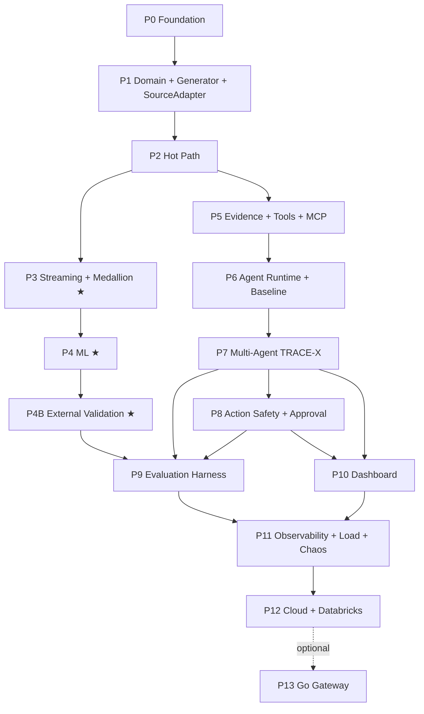

# TRACE-X — Implementation Roadmap (Phase Gates)

> The approved phase-gate plan. Authoritative for **what must be true before a phase is complete**.
> Live status lives in `docs/PROGRESS.md` and `tests/acceptance/status.json`.
>
> **A phase is never complete because code exists.** It is complete when every EXIT CONDITION is met
> with recorded evidence. See `docs/TESTING.md` § Definition of Done.

---

## Phase classification

| | Phases | Rule |
|---|---|---|
| **MANDATORY** | **0, 1, 2, 3, 4, 4B, 5, 6, 7, 8, 9, 10, 11, 12** | The project is not complete without every one of these. Data engineering (3, 4, 4B) is a core deliverable, not an enhancement. |
| **OPTIONAL / EXPERIMENTAL** | **13** | May be abandoned. Abandonment requires an ADR recording why. |

### Targets are measurement budgets, not claimed results

No detection-quality number is asserted in advance. The only quality gate is *beating the stated
baseline on a recorded evaluation run*. Any number appearing in a report must resolve to a run manifest
(`docs/EVALUATION.md`).

### Dependency graph

Longest chain: **P0 → P1 → P2 → P3 → P4 → P4B → P9**. P5–P8 run **parallel** to P3/P4 after P2 — that
parallelism is what keeps the mandatory data-engineering track from serialising the agentic track.

---

## Phase 0 — Foundation & Constitution  *(MANDATORY)*

**DEPENDENCIES:** none.

**ENTRY CONDITIONS**
- Architecture plan approved.

**IMPLEMENTATION**
- Repository skeleton; `CLAUDE.md` plus all control-plane documents.
- `pyproject.toml` with ruff / mypy / pytest / bandit configuration and the version pin matrix.
- `docker compose` `core` profile (Postgres, Redis) with non-colliding ports.
- Alembic migrations as the **single source of truth** for the five-schema role separation
  (`app`, `audit`, `groundtruth`, `eval`, `external`), the four service roles, and every grant.
  No second definition exists in a compose init script — the grants *are* the isolation control.
- `make doctor` asserting the full pin matrix (Spark 4.0.1 / Delta 4.0.1 / Hadoop 3.4.x / Temurin 17 /
  Python 3.12), disk, Docker RAM, ports, and the resolved LLM tier.
- OpenTelemetry and structured-logging scaffold with PII redaction.
- `make check-claims` benchmark-integrity linter.
- `tests/acceptance/status.json` and its tooling.
- CI: `lint` and `test-fast`.
- ADRs 0001–0010 and 0018.

**AUTOMATED TESTS**
- Lint, format, type-check, secret scan green.
- Migration up/down round-trip: downgrade must remove **all** schemas and roles, and a re-upgrade must
  restore them.
- Audit log is append-only at the database level: `trace_app` may `INSERT` but not `SELECT`, `UPDATE`
  or `DELETE`.
- **Ground-truth isolation: `trace_app` receives `permission denied for schema groundtruth`.**
- PII-redaction logging test.
- Version-pin assertion test.
- Dependency lock exists, pins exact versions, carries hashes, and covers every declared dependency.
- Trace context survives a non-HTTP hop; every log line carries `trace_id` inside a span; redaction is
  positionally last before the renderer.
- Claim-linter self-test: a fabricated number in a fixture fails the build.
- Acceptance-status integrity test: `PASS` without evidence is rejected.

**MANUAL VALIDATION**
- Fresh clone → `make doctor && make up` succeeds **with no API key set**.
- `docs/PROGRESS.md` alone is sufficient to resume cold.

**TARGETS**
- `make up` < 90 s; core profile RSS < 2.7 GB; `test-fast` < 5 min.
- `make doctor` fails loudly on Java 25.

**EXIT CONDITIONS**
- All control-plane documents exist and are non-placeholder.
- `make verify` green.
- Ground-truth isolation test passing.
- Claim linter active.
- ADRs merged.

---

## Phase 1 — Domain Model, Generator, Ground Truth, Source Adapters  *(MANDATORY)*

**DEPENDENCIES:** P0.

**ENTRY CONDITIONS**
- **Phase 0 exit conditions met** — all five, with evidence. Confirm in one command: `make verify`
  (expect 9/9) plus `make ci-status` (expect 4/4). `tests/acceptance/status.json` must show
  Phase 0 at 10/10 PASS.
- Working tree clean and pushed; `docs/PROGRESS.md` current.
- **No new environment prerequisites.** Phase 1 is pure Python: it needs neither Docker, Java/Spark
  (Phase 3), Ollama (Phase 6), nor cloud credentials (Phase 12). `make setup` is sufficient.
  Docker is needed only to re-run the Phase 0 integration suite.

**FIRST TASKS** — in dependency order; each is independently testable.

1. **Domain enums and errors** — `trace_core/domain/`: `FraudPattern`, `EvidenceKind`, `RiskBand`,
   `ActionType`, `TrustTier`, plus typed exceptions. Everything downstream references these, so they
   land first.
2. **Both state machines** — case lifecycle and investigation/agent lifecycle
   (`docs/ARCHITECTURE.md` §19, which specifies all three; the orchestration loop is also drawn in
   §8), as pure functions with an explicit legal-transition table. Illegal transitions must raise,
   not warn. Property-tested before anything imports them.
3. **Event JSON Schemas** — `docs/contracts/events/*.json` with the mandatory envelope
   (`docs/EVENT_CONTRACTS.md` §2). **Schemas first, Pydantic generated from them** — never the reverse.
4. **`CanonicalTransaction` + `SourceAdapter` port + `field_coverage`** (ADR-0022), with
   `GeneratorAdapter` as the first implementation and the conformance suite that Phase 4B's second
   adapter must also pass.
5. **Feature `required_fields` declarations** — the mechanism that makes an uncovered feature
   `UNAVAILABLE` rather than silently zero. Test it before any feature depends on it.
6. **Transaction generator** — seeded and digest-reproducible first; realistic diurnal, merchant and
   geographic distributions second.
7. **The 10 fraud scenarios**, each with its documented signature and its `causal_evidence_keys`
   written **only** to the `groundtruth` schema.
8. **CLI** emitting N transactions to file or Kafka, then freeze `eval-v1` and commit its digest.

**IMPLEMENTATION**
- Domain entities; agent state machine and case state machine.
- Event JSON Schemas; Pydantic generated **from** them.
- `CanonicalTransaction`, the `SourceAdapter` port, the `field_coverage` mechanism, `GeneratorAdapter`.
- Transaction generator with realistic diurnal, merchant and geographic distributions.
- All 10 fraud scenarios: account takeover, card testing, impossible travel, velocity attack, device
  farms, fraud rings, merchant collusion, credential stuffing, anomalous high-value, unusual
  location/device.
- `causal_evidence_keys` written to `groundtruth` — the basis of mechanically computable evidence
  metrics.
- CLI emitting N transactions to file or Kafka.

**AUTOMATED TESTS**
- Property: illegal state transitions raise.
- Generator determinism: same seed ⇒ identical digest.
- Each scenario produces its documented signature; base rate within configured tolerance.
- Schema round-trip.
- `SourceAdapterConformanceSuite` (one adapter now; two at P4B).
- Every feature declares `required_fields`; a feature with uncovered inputs returns `UNAVAILABLE`,
  never 0.

**MANUAL VALIDATION**
- Generate 1 M transactions; inspect distributions and a sample of each fraud pattern for plausibility.

**TARGETS**
- ≥ 50 k tx/s single-process generation; 1 M-row dataset < 500 MB Parquet; digest-reproducible.

**EXIT CONDITIONS**
- 10 scenarios implemented and documented.
- Ground truth written only to `groundtruth`.
- Frozen `eval-v1` dataset committed by digest.
- `SourceAdapter` port merged with ADR-0021 and ADR-0022.

---

## Phase 2 — Hot Path: Gateway, Rules, Online Features  *(MANDATORY)*

**DEPENDENCIES:** P1.

**ENTRY CONDITIONS** — P1 exit conditions met.

**IMPLEMENTATION**
- `trace-gateway`; Redis online feature store (sorted sets, HLL, hashes).
- ~20 features; declarative YAML rule engine (≥ 15 rules) with hot reload.
- `POST /v1/transactions`; triage into the investigation queue.
- Idempotency, rate limiting, degraded mode.
- OpenAPI generated and committed.

**AUTOMATED TESTS**
- Unit test per rule; feature correctness against a naive reference implementation.
- Idempotency: duplicate `transaction_id` ⇒ identical response, one side effect.
- Contract tests against the committed OpenAPI.
- Redis down ⇒ rules-only degraded mode, not a 500.

**MANUAL VALIDATION**
- Replay a generated stream through the gateway; confirm known-fraud transactions land in
  HIGH/CRITICAL bands.

**TARGETS**
- **p99 < 100 ms, p50 < 20 ms at 500 TPS sustained**, measured by k6 and recorded.
- Zero 5xx over a 10-minute run.

**EXIT CONDITIONS**
- Load report committed with real measured numbers.
- Degraded mode proven.
- OpenAPI under the CI breaking-change gate.

---

## Phase 3 — Streaming & Medallion  *(MANDATORY)*

**DEPENDENCIES:** P2.

**ENTRY CONDITIONS**
- P2 exit conditions met.
- Disk freed to ≥ 15 GB.
- `make doctor` green on the full pin matrix (Java **17**, not 25).

**IMPLEMENTATION**
- Kafka KRaft; Bronze / Silver / Gold Spark jobs with watermarking,
  `dropDuplicatesWithinWatermark`, late-event routing, checkpointing.
- Gold → Redis reconciliation job; `late_events` table; `feature_parity_drift` metric.
- `benchmarks/delta_layout/` harness running the real Gold query mix at ≥ 10 M rows across
  partitioning / partition+Z-order / liquid `CLUSTER BY`. **ADR-0015 is written from those numbers.**
- Medallion code written adapter-agnostically so P4B requires no changes to it.

**AUTOMATED TESTS**
- Integration on testcontainers Kafka + local Delta.
- Out-of-order events aggregate correctly by event time.
- Duplicates dropped exactly once.
- Late-beyond-watermark events land in `late_events`, never silently dropped.
- Checkpoint kill/resume: no data loss, no double-count.
- **Feature parity: online vs offline within tolerance on a 100 k-event stream.**
- Version-pin mismatch fails fast with an actionable message, not a `NoSuchMethodError`.

**MANUAL VALIDATION**
- Kill the Spark worker mid-stream; confirm checkpoint resume and correct final Gold state.
- Read the layout benchmark table and confirm ADR-0015's conclusion follows from it.

**TARGETS**
- Sustain ≥ 5 k events/s locally; consumer lag recovers to < 10 s after a 2-minute outage.
- Parity drift < 1% on windowed counters.
- Layout benchmark: ≥ 3 options × ≥ 3 query shapes with files-scanned and bytes-scanned recorded.
  **The winner is whatever the numbers say.**

**EXIT CONDITIONS**
- All medallion tables produced; parity test in CI; replay-from-offset demonstrated.
- **ADR-0015 merged citing committed benchmark output.**

---

## Phase 4 — Machine Learning  *(MANDATORY)*

**DEPENDENCIES:** P3.

**ENTRY CONDITIONS** — P3 exit conditions met.

**IMPLEMENTATION**
- Point-in-time-correct training set from Gold.
- LightGBM + Isolation Forest + robust-z control; isotonic calibration; temporal splits.
- MLflow tracking and registry; ensemble threshold selection.
- Artifact pinning by digest with boot-time verification; SHAP top-k in `RiskScore`; PSI drift job.

**AUTOMATED TESTS**
- Leakage: shuffled labels ⇒ PR-AUC ≈ base rate.
- Temporal-split assertion: no training row after any test row.
- Calibration: Brier improves versus uncalibrated.
- Serving/training parity on a fixed vector set.
- Corrupt artifact ⇒ gateway refuses to boot.

**MANUAL VALIDATION**
- Review the PR curve, reliability curve, confusion matrix at the chosen operating point, and SHAP
  explanations for 10 sampled transactions.

**TARGETS**
- **The ML arm must beat the rules-only arm on PR-AUC** on the held-out temporal test set. The margin
  is recorded, not predicted.
- Scoring adds < 15 ms p99 to the hot path.

**EXIT CONDITIONS**
- Model registered, versioned, digest-pinned and served; drift job running.
- Metrics recorded in `eval.synthetic_runs` with a complete manifest.
- Report header carries the mandatory synthetic-data caveat.

---

## Phase 4B — External Real-World Data Validation (IEEE-CIS)  *(MANDATORY)*

**DEPENDENCIES:** P4.

**ENTRY CONDITIONS**
- P4 exit conditions met.
- Kaggle credentials configured; `make fetch-external` verifies the recorded SHA-256.

**IMPLEMENTATION**
- `IeeeCisAdapter`: transaction+identity join, `field_coverage` declaration, `V*/C*/D*/M*` mapped to a
  typed `opaque_features` map.
- IEEE-CIS loaded through the **unmodified** medallion in `availableNow` mode.
- `external` schema and `eval.external_runs`.
- Experiments **E1** external-native, **E2** zero-shot transfer, **E3** fine-tune transfer,
  **E4** distribution shift (PSI/KS), **E5** operational smoke.
- `EXTERNAL-<run_id>.md` report template.

**AUTOMATED TESTS**
- `SourceAdapterConformanceSuite` green on **both** adapters.
- **Medallion-unmodified assertion: `git diff` of the stream package between P4 exit and P4B exit is
  empty** — the strongest available proof of ingestion adaptability.
- Declared coverage matches produced columns.
- **No-silent-imputation: every `UNAVAILABLE` feature propagates as null/absent, never 0.**
- Track separation: writing an agent-quality metric to `eval.external_runs` raises.
- Claim linter: pairing a Track-B run_id with an agent metric fails the build.

**MANUAL VALIDATION**
- Read the shift report; confirm the synthetic-to-real gap is stated numerically and prominently.
- Confirm no document implies synthetic accuracy predicts real-world performance.

**TARGETS**
- IEEE-CIS ingests end-to-end with **zero medallion code changes**.
- E1 PR-AUC recorded as the real-data reference point.
- **E2 is reported whatever it shows. A large degradation is an accepted, expected, publishable result
  and does NOT fail the phase.** The phase fails only if the pipeline cannot ingest the data, or if a
  number is published without its caveat.

**EXIT CONDITIONS**
- `EXTERNAL-<run_id>.md` committed with E1–E5.
- The synthetic-to-real gap quantified.
- Caveat present in every Track-A report header.
- ADR-0021 and ADR-0022 confirmed against reality.

---

## Phase 5 — Evidence, Tools, Policy, Authz, Audit, Graph, MCP Servers  *(MANDATORY)*

**DEPENDENCIES:** P2. Runs parallel to P3/P4.

**ENTRY CONDITIONS** — P2 exit conditions met.

**IMPLEMENTATION**
- Evidence ledger and hypothesis store.
- `ToolSpec` registry with ~18 tools.
- **One middleware chain**: authn → authz → rate limit → input validate → timeout → execute → output
  validate → `EvidenceEnvelope` → row cap → audit.
- **Three real MCP servers** — `fraud-intelligence-mcp`, `identity-mcp`, `graph-mcp` — over stdio
  (default) and streamable HTTP + OAuth 2.1 (`mcp-http` profile), as thin shells over the
  middleware-wrapped tools.
- `InProcessAdapter` retained for latency-sensitive and ledger-read tools.
- Capability tokens; policy engine and `ValidatedAction`; hash-chained audit and verifier.
- `GraphStore` with Neo4j **and** Postgres adapters; graph sync job.
- RBAC and Postgres RLS.

**AUTOMATED TESTS**
- Out-of-allow-list tool call raises and is audited.
- A capability token cannot reach another investigation's entities — **asserted over both transports**.
- Graph conformance green on **both** adapters.
- Audit verifier detects a tampered row.
- RLS blocks cross-role reads.
- `ValidatedAction` unconstructable outside the policy engine (type test).
- **`ToolTransportParitySuite`**: byte-identical `EvidenceEnvelope` and identical authz-denial,
  rate-limit, timeout, truncation and audit behaviour across MCP and in-process.
- **MCP protocol suite**: handshake, discovery, schema advertisement, OAuth 2.1 on HTTP, env token on
  stdio, malformed-response rejection.
- **No-unwrapped-entrypoint test**: no MCP server registers a function that bypasses the middleware.

**MANUAL VALIDATION**
- Run an MCP server standalone with a protocol inspector; confirm tools are discoverable and an
  unauthorized call is rejected **at the boundary**, not inside the app.
- Trace one transaction's tool calls end to end and read the resulting audit chain.

**TARGETS**
- Tool p95 < 200 ms in-process, **< 350 ms over MCP stdio** — the protocol hop's cost is measured and
  recorded, not assumed negligible.
- Graph tools < 500 ms. Audit verification of 100 k events < 5 s.

**EXIT CONDITIONS**
- Three MCP servers running and exercised by tests; transport-parity suite green.
- Both graph adapters green on one suite; tamper detection proven.
- Every tool has a spec, a test, a rate limit and a declared transport.
- ADR-0013 merged.

---

## Phase 6 — Agent Runtime, LLM Tiers & Single-Agent Baseline  *(MANDATORY)*

**DEPENDENCIES:** P5.

**ENTRY CONDITIONS** — P5 exit conditions met.

**IMPLEMENTATION**
- `LLMProvider` port with four tier-tagged adapters: `OllamaProvider` (SMOKE),
  `OpenAICompatibleProvider` (DEV), `BedrockProvider` (EVAL), `CassetteProvider` (CI).
- Tier gating in the evaluation writer.
- Structured-output enforcement; token and cost accounting.
- `AgentSpec` loader with runtime tool enforcement across **both** transports.
- Budget manager; LangGraph `PostgresSaver`; `trace-worker` with `SKIP LOCKED`.
- **Single-agent ReAct baseline (Arm D)** end to end.

**AUTOMATED TESTS**
- Provider conformance across **all four** adapters.
- Invalid output ⇒ one reprompt ⇒ ABSTAIN, never a loose parse.
- Budget exhaustion ⇒ `INSUFFICIENT_EVIDENCE`, never a hang.
- Worker kill mid-run ⇒ another worker resumes from the checkpoint.
- Cassette replay byte-deterministic.
- Tier gating: a `SMOKE` run cannot write a quality result to `eval.synthetic_runs`.
- **Keyless-clone test in CI with secrets unavailable: `make up && make demo` completes.**

**MANUAL VALIDATION**
- With **all API keys unset**, run `make pull-model && make demo` and watch a full investigation.
- Then run 10 investigations at DEV/EVAL tier and compare transcript quality by eye — confirming,
  not hiding, the gap.

**TARGETS**
- Single-agent p95 < 60 s at EVAL tier; cost per investigation recorded.
- 100% of tool calls inside the allow-list.
- **Local-model target is completion, not quality: ≥ 80% of smoke investigations reach a terminal
  state (a decision *or* an honest `INSUFFICIENT_EVIDENCE`) within budget.**

**EXIT CONDITIONS**
- Arm D runnable and measured; replay gives cost-free deterministic CI.
- **A fresh clone with no API key can run the demo.**
- ADR-0016 merged.

---

## Phase 7 — Multi-Agent TRACE-X  *(MANDATORY)*

**DEPENDENCIES:** P6.

**ENTRY CONDITIONS** — P6 exit conditions met.

**IMPLEMENTATION**
- All 9 agents; evidence-gap router; hypothesis lifecycle.
- Skeptic challenge/refutation loop; agent state machine; dissent capture; disagreement metric.
- SSE progress stream; injection defences and detector.

**AUTOMATED TESTS**
- **Path-variability test**: a device-farm case and an impossible-travel case must visit provably
  different agent sequences — the proof the path is not predetermined.
- Skeptic challenge creates new gaps and causes rerouting.
- Termination guaranteed under adversarial fixtures (property test: every generated state converges
  within budget).
- Orchestrator has zero tool access; Decision agent has zero retrieval access.
- **Red-team corpus**: decision distribution statistically unchanged versus a clean control; zero
  unauthorized tool calls.
- Every rationale claim cites resolvable `evidence_ids`.

**MANUAL VALIDATION**
- Walk 20 investigations across all 10 fraud patterns; verify reasoning is evidence-grounded and the
  Skeptic materially changes at least some outcomes.

**TARGETS**
- p95 < 120 s; budget-exhaustion rate < 10%.
- Unsupported-claim rate **measured and reported**; expected to be strictly lower than Arm D.

**EXIT CONDITIONS**
- Arm E runnable end to end; path variability proven by test; injection suite green.

---

## Phase 8 — Action Safety & Human Approval  *(MANDATORY)*

**DEPENDENCIES:** P7.

**ENTRY CONDITIONS** — P7 exit conditions met.

**IMPLEMENTATION**
- Full action pipeline; risk classification; approval queue and API.
- Idempotent executor with transactional outbox; `LocalLedgerAdapter` (a real ledger service).
- Verification read-back; compensation; circuit breakers; approval SLA and expiry.

**AUTOMATED TESTS**
- LLM output cannot reach the executor (type + integration test).
- Idempotency: same key twice ⇒ one effect.
- A HIGH-risk action without approval never executes.
- Verification failure ⇒ compensation ⇒ `ESCALATED`.
- Circuit breaker trips at threshold.
- Every executed action has an audit event linked to cited evidence.

**MANUAL VALIDATION**
- Approve and reject actions through the API; confirm ledger state and audit chain both reflect
  reality.

**TARGETS**
- **Zero unapproved HIGH-risk executions across the entire test corpus — a hard zero, not a
  percentage.**
- Execution p95 < 2 s.

**EXIT CONDITIONS**
- Full agent → action → verify → audit path works with a real executor; compensation proven.

---

## Phase 9 — Evaluation Harness & Benchmark  *(MANDATORY)*

**DEPENDENCIES:** P4, P4B, P7, P8.

**ENTRY CONDITIONS** — P4, P4B, P7 and P8 exit conditions met.

**IMPLEMENTATION**
- Harness running **Track A arms A–G** on frozen `eval-v1` and consuming **Track B experiments E1–E5**,
  written to disjoint tables and rendered by disjoint templates.
- All metrics; cassette recording.
- **Complete 25-field `RunManifest` builder and validator** — a run that cannot produce one is
  rejected.
- `make check-claims` enforcing all five publication rules.
- `RESULTS-<run_id>.md` and `EXTERNAL-<run_id>.md`; manifest-diff regression report.

**AUTOMATED TESTS**
- Metric implementations against hand-computed fixtures.
- Reproducibility: identical manifest ⇒ identical metrics.
- **No-hardcoded-expectations: the harness fails if the model is replaced by a constant predictor.**
- Ground truth reachable only as `trace_eval`.
- Manifest completeness: omitting any field rejects the run.
- `dirty_worktree: true` blocks publication.
- Tier gate: a non-EVAL quality number is rejected.
- Track crossing: a Track-B run_id beside an agent metric fails.
- Claim linter end-to-end over `README.md` and `docs/**`.

**MANUAL VALIDATION**
- Read both reports; confirm arm ordering is explicable; hand-audit 10 evidence-precision computations.
- Confirm the two tracks are structurally impossible to confuse and the synthetic caveat is
  unavoidable for a reader.

**TARGETS**
- Full 7-arm Track-A run over ≥ 1 000 investigations completes < 4 h in replay mode.
- **Arm E vs Arm D reported honestly whatever the outcome. Ablations F and G reported even if they
  show a component does not pay for itself. Track B's E2 gap reported prominently even if large.**

**EXIT CONDITIONS**
- `RESULTS-<run_id>.md` and `EXTERNAL-<run_id>.md` committed.
- **Every number anywhere in the repository traceable to a complete manifest.**
- Regression gate active; ADR-0017 merged.

---

## Phase 10 — Investigation Dashboard  *(MANDATORY)*

**DEPENDENCIES:** P7, P8.

**ENTRY CONDITIONS** — P7 and P8 exit conditions met.

**IMPLEMENTATION**
- Next.js + TypeScript with the generated API client.
- Live transaction feed; case queue; investigation detail (timeline, evidence ledger with provenance
  and trust tier, hypothesis board, dissent panel); graph visualization; approval workflow; model and
  evaluation dashboards; SSE live progress.

**AUTOMATED TESTS**
- `tsc --noEmit`; component tests; Playwright E2E for the approval flow.
- The generated client compiles against the committed OpenAPI (breaking-change gate).

**MANUAL VALIDATION**
- An analyst can, without reading code, understand why a decision was made and act on it.

**TARGETS**
- LCP < 2 s locally; investigation detail renders 200 evidence records without jank.

**EXIT CONDITIONS**
- Approval flow usable end to end; every decision traceable to cited evidence in the UI.

---

## Phase 11 — Observability, Load, Chaos Hardening  *(MANDATORY)*

**DEPENDENCIES:** P9, P10.

**ENTRY CONDITIONS** — P9 and P10 exit conditions met.

**IMPLEMENTATION**
- Full OTel trace propagation: HTTP → Kafka header → Spark → agent node → tool (incl. MCP) → action.
- All metrics; 5 provisioned Grafana dashboards; alert rules.
- k6 load suite; toxiproxy chaos suite covering **every** row of the failure model.
- Optional kind manifests.

**AUTOMATED TESTS**
- Trace continuity: one `trace_id` spans ingest → audit.
- Each failure-model row has a chaos test asserting the documented behaviour.
- Load suite at smoke scale in CI, full scale pre-release.

**MANUAL VALIDATION**
- Inject each failure by hand; confirm dashboards and alerts make the cause obvious within 60 s.

**TARGETS**
- Gateway p99 < 100 ms at 500 TPS with `obs` enabled (instrumentation overhead < 10%).
- Every chaos scenario recovers without data loss or manual repair.

**EXIT CONDITIONS**
- Chaos suite green; dashboards provisioned as code; runbook complete in `docs/OPERATIONS.md`.

---

## Phase 12 — Cloud Validation (funded window)  *(MANDATORY)*

**DEPENDENCIES:** P11.

**ENTRY CONDITIONS**
- P11 exit conditions met.
- AWS credentials configured; budget cap and alarm set.
- Teardown automation tested against a dry-run stack.

**IMPLEMENTATION**
- Terraform modules and the `validation` environment; EKS, MSK, RDS, ElastiCache, S3 Delta, Neptune.
- `NeptuneGraphStore` adapter; Bedrock `LLMProvider` (EVAL tier) with a Guardrail.
- **AgentCore Gateway federating the three MCP servers that already exist and already pass the parity
  suite** — adding IAM/SigV4 and VPC reach, not a new protocol.
- Databricks Asset Bundles running the *same* `trace_core.stream` code.
- **Databricks tables using liquid clustering / `CLUSTER BY AUTO` + predictive optimization per
  ADR-0015, deliberately re-decided rather than inherited from the local layout.**
- Unity Catalog with ground-truth isolation mirrored; `external` catalog for Track B.

**AUTOMATED TESTS**
- `terraform validate`, `tflint`, `checkov`, `conftest` in CI.
- Neptune passes the **same** `GraphStoreConformanceSuite`.
- Bedrock passes the **same** `LLMProviderConformanceSuite`.
- **AgentCore Gateway passes the same `ToolTransportParitySuite`** — a third transport, one suite.
- Cloud smoke E2E: one transaction → investigation → decision → action → audit, in AWS.

**MANUAL VALIDATION**
- Execute the window: apply → smoke + one EVAL-tier eval arm + one Databricks Track-B job → compare
  the Databricks layout benchmark against the local one → screenshot dashboards → capture actual cost
  → `terraform destroy` → verify zero residual billable resources.

**TARGETS**
- Apply < 45 min.
- EVAL-tier benchmark numbers captured with complete manifests — the only publishable tier.
- Validation-window cost recorded under the budget cap.
- Destroy leaves zero billable resources, verified in Cost Explorer the following day.

**EXIT CONDITIONS**
- Cloud run evidenced with artifacts, manifests and real cost.
- IaC committed and plan-clean.
- AgentCore Gateway proven as a transport over pre-existing MCP servers.
- ADR-0015 updated with Databricks-side numbers; any local/cloud divergence recorded, not reconciled
  away.
- Environment destroyed.

---

## Phase 13 — Go Ingest Gateway  *(OPTIONAL / EXPERIMENTAL)*

**DEPENDENCIES:** P11 (P12 not required).

**ENTRY CONDITIONS**
- P11 exit conditions met.
- Phase 2 load numbers recorded as the baseline to beat.

**IMPLEMENTATION**
- Go reimplementation of `trace-gateway` **only**, against the identical OpenAPI and event schemas.
- Shared cross-language conformance suite.

**AUTOMATED TESTS**
- The Python gateway's entire contract suite runs unmodified against the Go binary.
- Byte-identical event payloads for a fixed input corpus.

**MANUAL VALIDATION**
- Side-by-side k6 run: same hardware, same dataset.

**TARGETS**
- **Go must beat the recorded Python p99 by a margin worth the second toolchain, or the phase is
  abandoned and an ADR records why.**

**EXIT CONDITIONS**
- Measured comparison published, **or** a documented rejection ADR. Both are acceptable outcomes.
